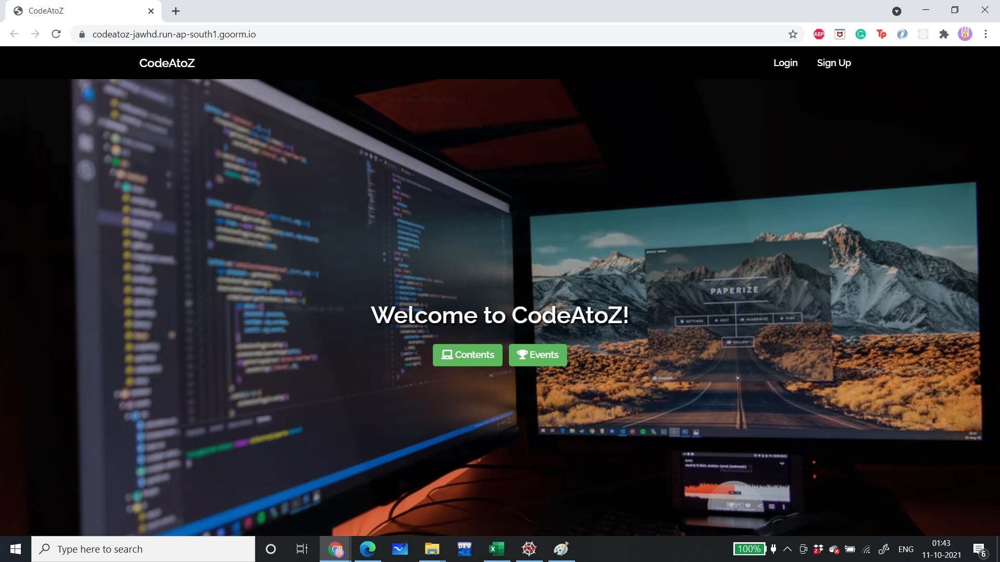
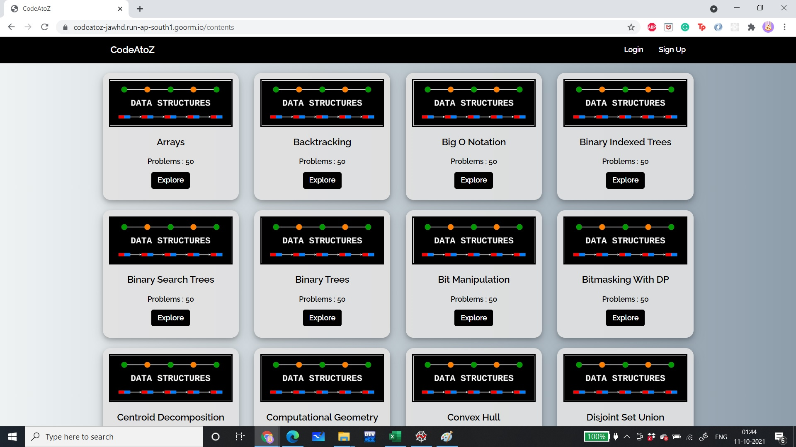
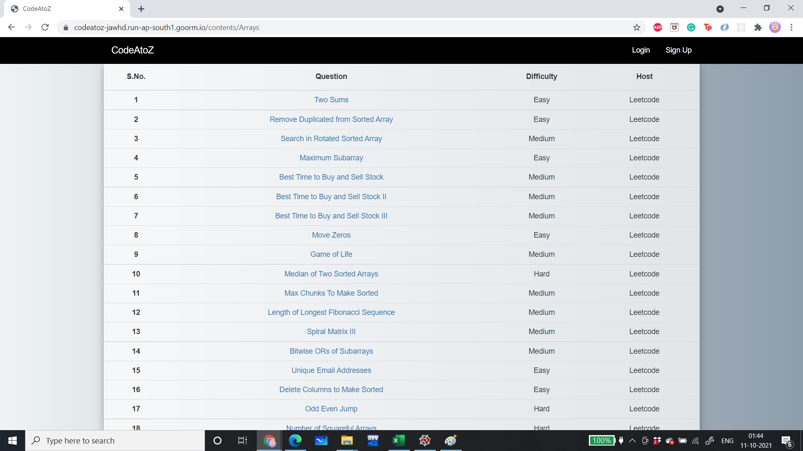
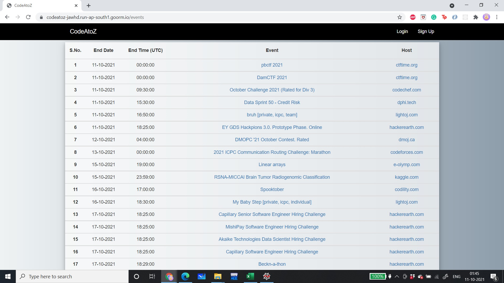
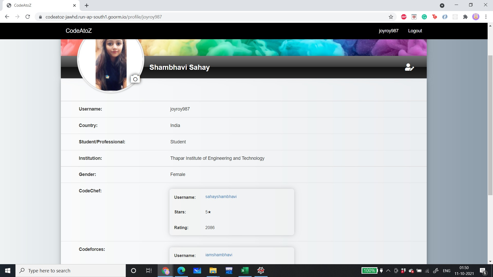
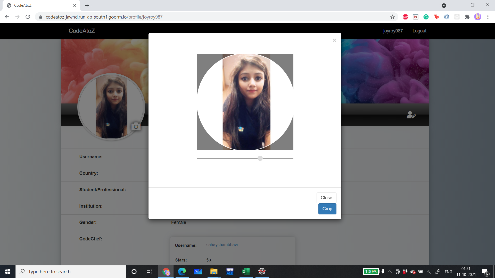

# CODE-A-TO-Z

The homepage that is visible to the user on visiting the website is as follows:

When the user clicks on the Contents button, he is directed to the following page:

Upon clicking the Explore button from any card, he is directed to the following page:

When the user clicks on the Events button, he is directed to the following page:

The profile for each user is as follows:

When the user clicks the camera besides the profile picture, he needs to select a photo and then he needs to crop the image. The view for the same is as follows:

